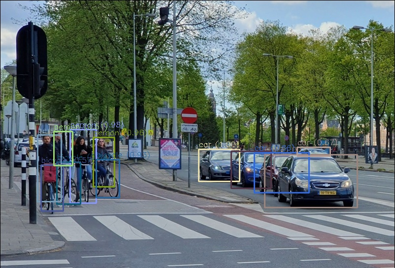

# Object Detection with YOLO and OpenCV

This is a project for object detection using the YOLO (You Only Look Once) model and the OpenCV library. The detector identifies objects in an image and draws bounding boxes around them, along with class labels and confidence scores.

## Requirements

- Python 3.x
- OpenCV 4.5.3.56
- YOLO model files (yolov3.cfg, yolov3.weights)
- Class names file (coco.names)
- An input image with a perspective similar to the human eye

## Installation

1. Clone or download this repository to your local machine.

2. Ensure you have the correct version of OpenCV (4.5.3.56) installed. You can install it using pip:
```python
   pip install opencv-python==4.5.3.56
```

3. Place the YOLO model files (`yolov3.cfg` and `yolov3.weights`) in the project directory.

4. Place the class names file (`coco.names`) in the project directory.

5. Make sure you have an input image with a perspective similar to the human eye. Rename it to `yolo_prueba.png` and place it in the project directory.

## Usage

Run the `main.py` script to execute the object detector on the input image. Detected objects will be highlighted with bounding boxes and class labels, and the resulting image will be saved as `output_image.jpg`.

Adjust the confidence threshold by modifying the `confidence_threshold` variable in the `main.py` script to suit your needs.

```python
confidence_threshold = 0.5  # Set your desired confidence threshold
````
## Example

Below is an example of the output from the YOLO and OpenCV object detection:



In the sample image, detected objects are highlighted with bounding boxes and class labels, along with their respective confidences.

